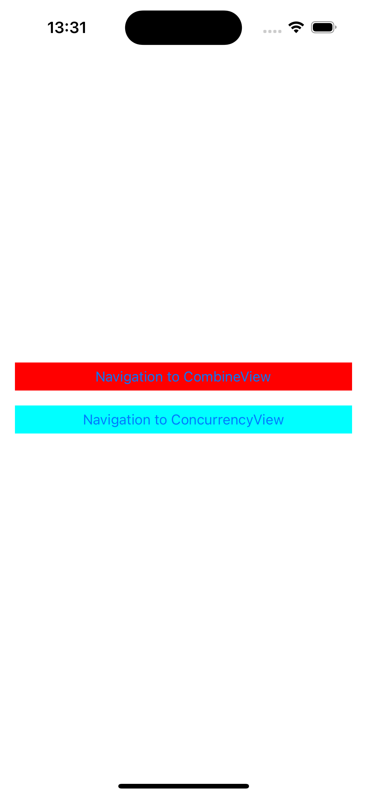
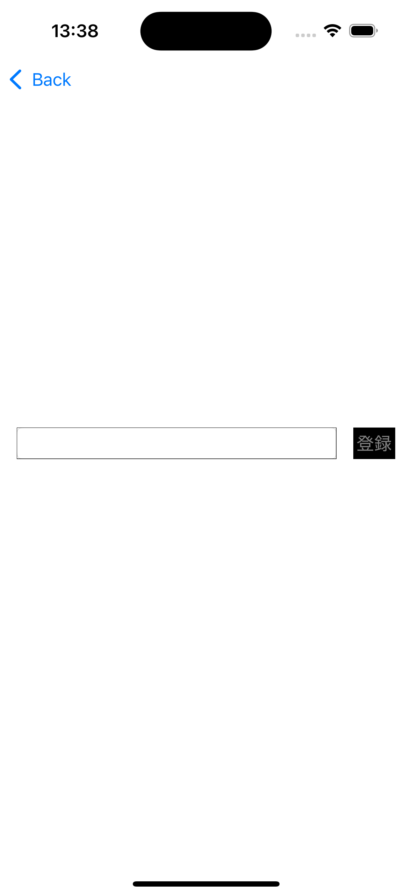

# SwiftConcurrencyExample

SwiftConcurrency でリアクティブプログラミングする例

## 概要

リアクティブプログラミングを Combine、Swift Concurrency 両方を同じ仕様の別画面でそれぞれ実装し、
双方でのようなメリットデメリットがあるのかを検討するためのサンプルプロジェクトです。

## サンプルアプリの仕様

初回画面で 2 つボタンを用意して、押下することで Combine、Swift Concurrency それぞれで実装された画面へと遷移します。

遷移先の画面では以下仕様の画面を実装しています。

- テキストフィールドと登録用のボタンを配置する
- 登録ボタンはテキストフィールドに以下種類の文字以外が含まれていない時、かつテキストが空でない場合に、活性にする。
  - 小文字のアルファベット
  - 大文字のアルファベット
  - 数字
- テキストフィールドに上記条件に外れる文字が入力された場合、テキストフィールドの下に登録できない旨のメッセージを表示する
- 登録可能な文字が入力されている場合は、メッセージは非表示にする
- 画面表示時のテキストフィールドがからなときは、メッセージは非表示にする
- 登録ボタン押下すると、テキストフィールドは空になり、永続化データとして保存する(既存の永続化データは上書きする)
- 登録ボタン押下時に、キーボードは非表示にする
- Return 押下でキーボードは非表示にする

### 初回画面

### 遷移先画面

## アーキテクチャ

MVP
